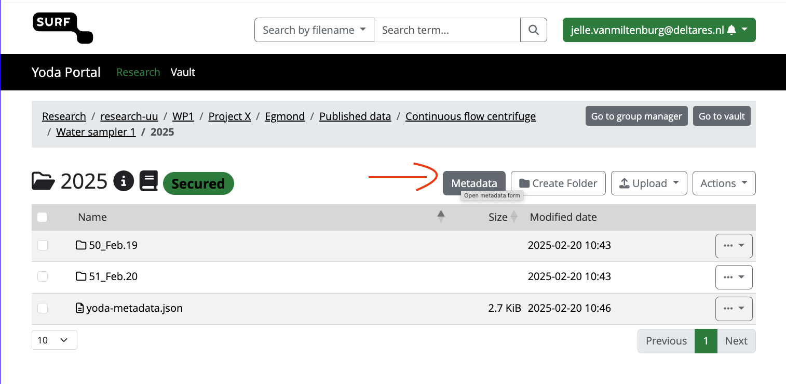

# Adding Metadata in Yoda

## Overview

This guide explains how to add metadata to your files in Yoda for the Delta Enigma project. Proper metadata is crucial for making your data findable, accessible, and reusable by other researchers.

## Prerequisites

- Uploaded data to Yoda (see [Uploading Data](01_upload_data.md))
- Access to [SURF Yoda portal](https://deltaenigma-yoda.irods.surfsara.nl/)

## Required Metadata Fields

For the Delta Enigma project, the following metadata fields are mandatory:

- **Title**: A descriptive name for your dataset
- **Description**: Brief explanation of what the data represents
- **Creator**: Name of the person who created the data
- **Collection Date**: When the data was collected
- **Location**: Geographic location where data was collected
- **Instrument**: Device or method used to collect the data
- **Work Package**: The Delta Enigma work package this data belongs to

## Adding Metadata

### Step-by-Step Guide

1. **Select Your Files**
   - Navigate to your data folder in Yoda
   - Select the file(s) you want to add metadata to
   - Click the "Metadata" button in the top menu



2. **Fill in Metadata Fields**
   - Complete all mandatory fields
   - Add any additional relevant information
   - Be as specific and accurate as possible

3. **Save Your Changes**
   - Click "Save" to apply the metadata
   - Verify that the metadata was saved successfully

### Best Practices

- Add metadata immediately after uploading files
- Use consistent terminology across your datasets
- Include units of measurement where applicable
- Be specific in your descriptions
- Cross-reference related datasets if applicable

### Example Metadata Entry

Here's an example of good metadata for a camera image:

```
[Actual example is coming soon]
```

## Updating Metadata

To modify existing metadata:

1. Select the file(s)
2. Click "Metadata"
3. Update the necessary fields
4. Save your changes


## Additional Resources

- [Delta Enigma Metadata Standards](../01_data_guidelines/02_metadata_standards.md)
- [Data Collection Guidelines](../01_data_guidelines/01_data_collection.md)
- Contact your [Data Steward](../03_general_info/02_data_stewards.md) for assistance

